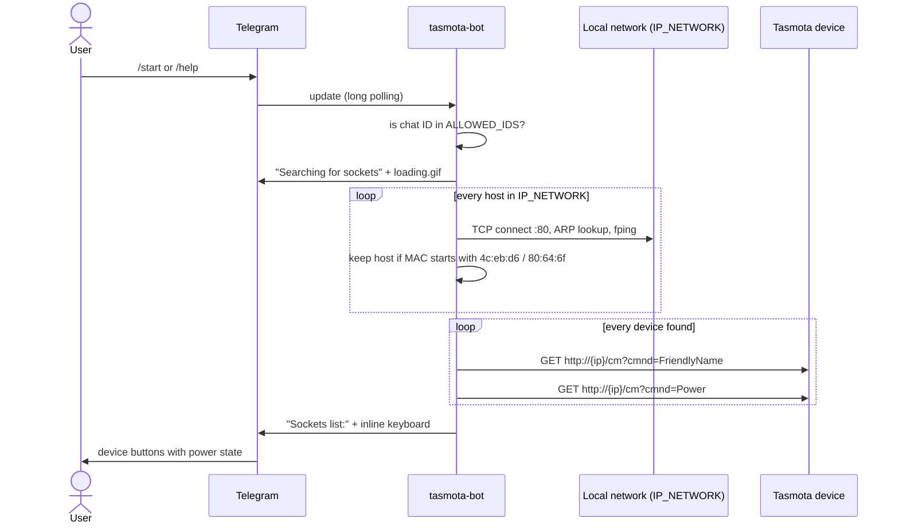

# tasmota-bot

A Telegram bot for Tasmota smart plugs on your local network. Send `/start` and the bot
scans a subnet you choose, finds Tasmota devices, and replies with a list that shows each
device's friendly name and power state (`ON` / `OFF`).

The bot talks to each device over the Tasmota HTTP command API (`/cm?cmnd=...`). It doesn't
use MQTT, and it needs no list of devices, because it finds them by scanning the network.

> **Project status:** early work in progress (version `1.0.0` in [`VERSION`](VERSION)). The
> bot can **list** devices and their power state. It can't switch them on or off yet: the
> device buttons are shown, but nothing handles a tap. See [Known limitations](#known-limitations).

## Table of contents

- [Features](#features)
- [How it works](#how-it-works)
- [Requirements](#requirements)
- [Installation](#installation)
- [Configuration](#configuration)
- [Usage](#usage)
- [Known limitations](#known-limitations)
- [Troubleshooting](#troubleshooting)
- [Security notes](#security-notes)
- [Development](#development)
- [Contributing](#contributing)
- [License](#license)

## Features

- **Telegram interface** built on [pyTelegramBotAPI](https://github.com/eternnoir/pyTelegramBotAPI)
  (`telebot`), using long polling. No public webhook or open inbound port is needed.
- **Chat allowlist:** the bot only answers chats listed in `ALLOWED_IDS`.
- **Automatic discovery:** scans every address in the `IP_NETWORK` subnet and keeps the hosts that:
  - have an entry in the local ARP table;
  - answer a ping (`fping`);
  - have a MAC address that starts with `4c:eb:d6` or `80:64:6f` (Espressif OUIs, as used by
    many ESP8266/ESP32-based Tasmota plugs).
- **Device list as an inline keyboard:** one button per device, labelled
  `<FriendlyName>  (<Power state>)`.
- **Optional device web password:** one Tasmota username and password, shared by all devices
  (`TASMO_USER` / `TASMO_PASSWORD`).
- **Loading animation** (`app/loading.gif`) while the scan runs.

## How it works



Code layout:

| File | Purpose |
|------|---------|
| [`app/app.py`](app/app.py) | Bot entry point: reads the environment, scans the network, and handles `/start` and `/help`. |
| [`app/device.py`](app/device.py) | `Device` class: wraps the Tasmota HTTP API (`Power`, `FriendlyName`, `Status 10`). |
| [`app/config.yaml`](app/config.yaml) | Empty device-list template. **The code doesn't read it yet** (see [Configuration](#configuration)). |
| [`app/loading.gif`](app/loading.gif) | The animation shown while the scan runs. |

## Requirements

- A **Telegram bot token** from [@BotFather](https://t.me/BotFather).
- The **chat ID(s)** allowed to use the bot. For example, message [@userinfobot](https://t.me/userinfobot) to get your own chat ID.
- **Tasmota devices** reachable over HTTP (port 80) from the host that runs the bot, **on the
  same Layer-2 network**. Discovery reads the host's ARP table, so the bot must see the devices'
  MAC addresses (with Docker, this means host networking; see [Troubleshooting](#troubleshooting)).
- **Python 3** and the `fping` binary, if you run the bot from source.
- Python packages: `pyTelegramBotAPI`, `requests`, `loguru`, `pyyaml`, `wakeonlan`, `urllib3>=2.2.2`
  (from [`requirements.txt`](requirements.txt), all unpinned except `urllib3`), plus
  `mac_vendor_lookup` and `arpreq`. The code imports these two, but `requirements.txt` doesn't
  list them. Install them by hand.

## Installation

### From source (recommended)

This is the method that currently works.

```bash
git clone https://github.com/t0mer/tasmota-bot.git
cd tasmota-bot
sudo apt install fping build-essential python3-dev   # or your distro's equivalent
python3 -m venv .venv && . .venv/bin/activate
pip install -r requirements.txt mac_vendor_lookup arpreq   # arpreq is source-only and needs a C compiler

export BOT_TOKEN=<your-telegram-bot-token>
export ALLOWED_IDS=<chat-id>
export IP_NETWORK=192.168.1.0/24

cd app                            # loading.gif is opened by a relative path
python3 app.py
```

### Docker Compose

[`docker-compose.yaml`](docker-compose.yaml) references the image `techblog/tasmota-bot`, but
that image **isn't published on Docker Hub** (checked 2026-09-29). There are no GitHub releases,
no git tags, and no CI workflow in this repo. Build the image yourself first:

```bash
git clone https://github.com/t0mer/tasmota-bot.git
cd tasmota-bot
docker build -t techblog/tasmota-bot .
```

> **WARNING:** the Dockerfile doesn't build as-is:
> - It uses an Alpine base image (`python:3.14.0a3-alpine3.20`) but installs `fping` with `apt`,
>   so the build fails with `/bin/sh: apt: not found`.
> - Even with that fixed, the `ENTRYPOINT` points at `/usr/bin/python3`, which doesn't exist in
>   the image (the interpreter is `/usr/local/bin/python3`).
> - `mac_vendor_lookup` and `arpreq` aren't installed.
>
> The Compose setup below only works once the image can be built. Until then, use
> [From source](#from-source-recommended).

Then run it with Compose. This example is the repo's compose file, with the settings
discovery needs added (`IP_NETWORK`, and `network_mode: host`):

```yaml
services:
  tasmota-bot:
    image: techblog/tasmota-bot
    container_name: tasmota-bot
    restart: always
    network_mode: host          # needed for ARP-based discovery (not in the repo's compose file)
    environment:
      - BOT_TOKEN=<your-telegram-bot-token>
      - ALLOWED_IDS=<chat-id-1>,<chat-id-2>
      - IP_NETWORK=192.168.1.0/24
      # - TASMO_USER=admin
      # - TASMO_PASSWORD=<tasmota-web-password>
    volumes:
      - ./tasmota-bot/config:/app/config
```

```bash
docker compose up -d
docker compose logs -f tasmota-bot
```

The repo's compose file mounts `./tasmota-bot/config` at `/app/config` (the Dockerfile creates
this folder). The bot doesn't read anything from it yet.

## Configuration

The bot is configured **only through environment variables**. None of them has a default.

| Env var | Required | Default | Description |
|---------|----------|---------|-------------|
| `BOT_TOKEN` | yes | none | Telegram bot token from @BotFather. |
| `ALLOWED_IDS` | yes | none | The chat IDs allowed to use the bot, for example `123456789,987654321`. The code checks this with a **substring** match (`str(chat.id) in ALLOWED_IDS`), so any separator works. See [Security notes](#security-notes). |
| `IP_NETWORK` | yes | none | The subnet to scan, in CIDR notation (for example `192.168.1.0/24`). The bot fails at startup if this is missing or invalid. |
| `TASMO_USER` | no | none | The Tasmota web username, sent as HTTP Basic auth to every device. The Tasmota web username is always `admin`. See [Known limitations](#known-limitations) about password-protected devices. |
| `TASMO_PASSWORD` | no | none | The Tasmota web password, shared by all devices. |

The Dockerfile also sets `ENV BOT_TOKEN ""` and `ENV ALLOWD_IDS ""`. The second name is
misspelled, so it has no effect: set `ALLOWED_IDS` yourself.

### `config.yaml` (not used yet)

[`app/config.yaml`](app/config.yaml) is a template for a static device list with per-device
credentials. **The current code doesn't load it**: devices come from the network scan, and
credentials come from `TASMO_USER` / `TASMO_PASSWORD`. Its schema, with placeholders:

```yaml
tasmotas:
  - name: Living room plug
    ip: 192.168.1.50
    user: admin
    password: <tasmota-web-password>
```

<!-- TODO: verify — intended future use of config.yaml and the /app/config volume. -->

## Usage

| Command / button | What it does |
|------------------|--------------|
| `/start` | Checks the chat against `ALLOWED_IDS`. Shows "Searcing for sockets" (sic) with a loading animation, scans `IP_NETWORK`, then replies with **"Sockets list:"** and one inline button per Tasmota device found. |
| `/help` | Same as `/start`. |
| Device button (`_device_<ip>`) | Shows the device's friendly name and current power state (`ON` / `OFF`). **Tapping it does nothing yet:** there is no callback handler. |

Messages from chats that aren't in `ALLOWED_IDS` get no reply.

The scan checks every address in the subnet one after another, so a `/24` can take a while.
Use the smallest subnet that holds your devices.

## Known limitations

These come from the current code. They are listed here so you know what to expect:

- **No power switching:** the device buttons have no `callback_query_handler`, so the bot can't
  toggle a device yet.
- **The "list" keyboard is unused:** a Hebrew "socket list" button (`callback_data: list`) is
  defined, but nothing sends or handles it.
- **`config.yaml` is ignored:** see [Configuration](#configuration).
- **Energy readings aren't in the bot:** `app.py` has a `run()` helper that prints energy data
  from `Status 10` (total, today, yesterday, voltage, current) to the console, but the bot never
  calls it.
- **Password-protected devices probably don't work:** the bot sends `TASMO_USER` /
  `TASMO_PASSWORD` as HTTP Basic auth, but Tasmota's `/cm` endpoint expects the credentials as
  query parameters (`user=admin&password=...`). A device with a web password then fails, and
  "Sockets list:" arrives with no buttons. The credentials are also shared by all devices.
  <!-- TODO: verify on a device -->
- **The discovery MAC filter is fixed:** only the prefixes `4c:eb:d6` and `80:64:6f` are matched.
  Tasmota devices with other MAC prefixes aren't found.
- `EXPOSE 8081` in the Dockerfile has no effect: the bot doesn't listen on any port.

## Troubleshooting

- **The bot doesn't reply to `/start`:** make sure your chat ID is in `ALLOWED_IDS`. If
  `ALLOWED_IDS` isn't set, the handler raises an error that is only logged, and the bot stays
  silent. Check the logs (`docker compose logs tasmota-bot`).
- **The bot exits at startup with an `ip_network` error:** `IP_NETWORK` is missing or isn't a
  valid CIDR network (for example, `192.168.1.10/24` has host bits set; use `192.168.1.0/24`).
- **"Sockets list:" is empty:**
  - Discovery reads the host's ARP table. In Docker's default bridge network the container can't
    see your LAN's MAC addresses, so run the container with `network_mode: host`.
  - Your devices' MAC addresses must start with `4c:eb:d6` or `80:64:6f`.
- **`fping` is required** for the ping filter in discovery. Install it and make sure it may send
  ICMP.
- **"Sockets list:" arrives with no buttons:** the device probably has a web password. See the
  password limitation under [Known limitations](#known-limitations).
- **`FileNotFoundError: loading.gif`:** start the bot from the `app/` folder. The Docker image
  already sets `WORKDIR /app`.
- **`ModuleNotFoundError: mac_vendor_lookup` or `arpreq`:** install both packages. They aren't in
  `requirements.txt`.

## Security notes

- **Restrict the bot.** Always set `ALLOWED_IDS` to only your own chat IDs. Be aware that the
  check is a substring match: any chat whose ID appears inside the value passes (for example,
  `2345` passes when the value is `123456789`). Choosing the value carefully doesn't prevent
  this; it can only be fixed in code.
- **Tasmota's HTTP API is plain HTTP.** Commands and any web password are sent unencrypted on
  your LAN, and a device with no web password accepts commands from anyone on the network.
  Set a web password on your devices and keep them on a trusted network or VLAN.
- **Don't commit real secrets.** Keep the bot token, chat IDs and device passwords out of
  `docker-compose.yaml` and `config.yaml` in git. Use an `.env` file or your orchestrator's
  secret store. If a token leaks, revoke it with @BotFather (`/revoke`).
- **Network scanning:** the bot probes every address in `IP_NETWORK` (TCP port 80, ICMP). Only
  point it at networks you own.

## Development

```text
.
├── app/
│   ├── app.py          # bot, network discovery, keyboards
│   ├── device.py       # Tasmota HTTP API wrapper
│   ├── config.yaml     # device-list template (not used yet)
│   └── loading.gif     # scan animation
├── Dockerfile
├── docker-compose.yaml
├── requirements.txt
├── VERSION
└── LICENSE
```

- Run it locally as described in [From source](#from-source-recommended). Logging uses
  [loguru](https://github.com/Delgan/loguru) and goes to stderr.
- To test the Tasmota calls without Telegram, call `run()` in `app.py` instead of
  `bot.infinity_polling()`. It prints each discovered device's power state and energy readings.
  `BOT_TOKEN` must still be set to a correctly formatted token, because `TeleBot` is created
  when `app.py` is imported.
- There are no tests, linters or CI workflows in this repo.

## Contributing

Issues and pull requests are welcome at
[github.com/t0mer/tasmota-bot](https://github.com/t0mer/tasmota-bot). Please keep changes
focused, and describe how you tested them against a real Tasmota device.

## License

Licensed under the [Apache License 2.0](LICENSE).
